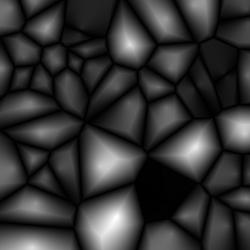
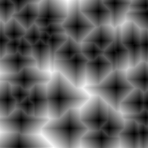

# worley-noise

Worley noise in JavaScript.

## What is it?
Worley noise (also called Voronoi or Cell noise) is a type of noise where the value of a point is based on its distance to a set of previously placed points. By using the distance to the closest point it produces images like this:


But we don't have to use the closest point, we can choose the second, third, etc. We can even combine these values by performing mathematical operations on them like addition and subtraction:

 

The previous images were generated by using the Euclidean distance for the calculations. If we use Manhattan distance we get quite different results:

 

The formula for generating these images can be found in the advanced example.

## Getting Started
Download the [development][max] or the [minified][min] version.

[max]: https://raw.githubusercontent.com/zsoltc/worley-noise/master/bin/worley-noise.dev.js
[min]: https://raw.githubusercontent.com/zsoltc/worley-noise/master/bin/worley-noise.min.js

Example usage:

```html
<script src="worley-noise.dev.js"></script>
<script>

</script>
```
Canvas examples can be found in the project.

## AMD, CommonJS
The project is built with [Browserify](http://browserify.org) `--standalone` option which generates [UMD](http://davidbcalhoun.com/2014/what-is-amd-commonjs-and-umd/) modules, so there should be no problem using this library in these environments.
